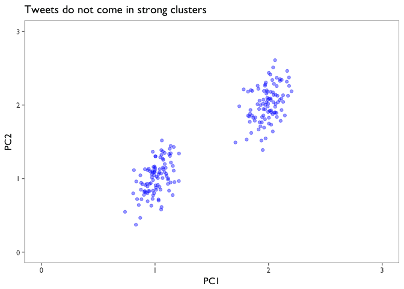
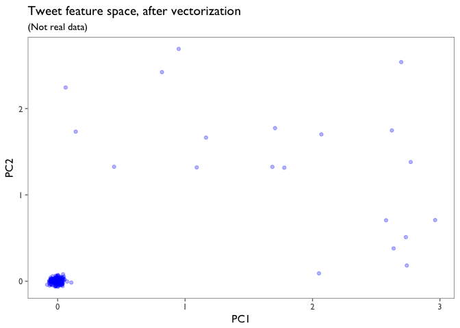
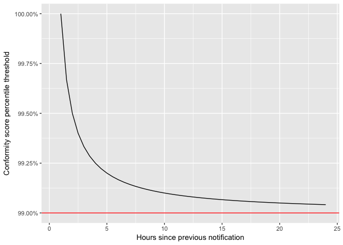

NLP News Tweets: Methodology
================

The goal of this project was to scan all tweets authored by some 25 news publications, and send a notification (i.e. a single tweet) when a big story breaks. This came with a number of challenges.

1. What data to use?
--------------------

Twitter's API provides many attributes for each [tweet](https://dev.twitter.com/overview/api/tweets) and each [user](https://dev.twitter.com/overview/api/users). I decided to keep things simple: I took each tweet's id, its creation time, its text, its favorite count, its retweet count, and its retweet status (i.e. whether or not it was itself a retweet). I also took each tweet's author's username and screen name.

Most of these tweets link to full news stories on their respective publication's webpages. I considered scraping the text of the full stories using Python [Goose](https://github.com/grangier/python-goose), but decided to see how far I could get with the text of the tweets alone, since I anticipated there being some difficulties getting around paywalls. Not to mention that text data fram HTML can be quite messy.

As for how *much* data to store, I decided to keep only the tweets from the past 24 hours. This usually amounts to about 5000 tweets.

2. How to identify important news stories?
------------------------------------------

This was the main challenge. At first I tried a few off-the-shelf clustering algorithms from sklearn, which required me to first vectorize the tweet texts. I created a document-term matrix, like the example below:

<table style="width:64%;">
<colgroup>
<col width="20%" />
<col width="18%" />
<col width="12%" />
<col width="12%" />
</colgroup>
<thead>
<tr class="header">
<th></th>
<th align="right">test</th>
<th align="right">Japan</th>
<th align="right">ballistic</th>
</tr>
</thead>
<tbody>
<tr class="odd">
<td>North Korea fires missile into waters off Japan <a href="https://t.co/iBM24KTIyU" class="uri">https://t.co/iBM24KTIyU</a></td>
<td align="right">0</td>
<td align="right">1</td>
<td align="right">0</td>
</tr>
<tr class="even">
<td>Japan to take 'concrete action' with US against North Korea after its latest ballistic missile test… <a href="https://t.co/ycZmzebnVa" class="uri">https://t.co/ycZmzebnVa</a></td>
<td align="right">1</td>
<td align="right">1</td>
<td align="right">1</td>
</tr>
<tr class="odd">
<td>MORE: If confirmed as a ballistic missile test, it would be the ninth such test conducted by North Korea this year. <a href="https://t.co/jP7hmAXhww" class="uri">https://t.co/jP7hmAXhww</a></td>
<td align="right">2</td>
<td align="right">0</td>
<td align="right">1</td>
</tr>
</tbody>
</table>

The real document-term matrix had one row for every tweet in the dataset, and one column for each of the top 200 most common words in the whole corpus (after removing [stop words](https://en.wikipedia.org/wiki/Stop_words)). With a few variants of the document-term matrix (word counts and [tf-idf](https://en.wikipedia.org/wiki/Tf%E2%80%93idf), with varying thresholds for inclusion in the matrix), I tried two clustering algorithms: k-means and agglomerative hierarchical clustering.

There were two problems with these approaches. The first problem is that there isn't a good way to choose the number of clusters to look for. If the goal had been simply to model the variance in the tweets as well as possible, then I could have done a grid search over some predefined list of *k*-values, and chosen the model with the best [silhouette](https://en.wikipedia.org/wiki/Silhouette_(clustering)) score. But the goal isn't the model the variance; the goal is to quickly identify a breaking news story, when it occurs, and then select the tweet that is most representative of that story. Besides, we know that the nature of the data is not that each tweet belongs to a clear cluster. The data does *not* look like this:

``` r
x <- rnorm(n = 200, mean = c(1,2), sd = c(0.1,0.1))
y <- c()
for (i in 1:length(x)) {
        y <- append(y, x[i] + rnorm(1, 0, 0.2))
}
data <- data.frame(x = x, y = y)
ggplot(data) +
        geom_point(aes(x = x, y = y), alpha = 0.4, color = "blue") +
        scale_x_continuous(limits = c(0,3)) +
        scale_y_continuous(limits = c(0,3))
```



Rather, a select few tweets will all be lexically close to each other, and everything else will be scattered all across the feature space, more like this:

``` r
x <- runif(n = 180, min = 0, max = 3)
x <- append(x, rnorm(n = 20, 1, 0.03))
y <- runif(n = 180, min = 0, max = 3)
y <- append(y, rnorm(n = 20, 1, 0.03))
data <- data.frame(x = x, y = y)
ggplot(data) +
        geom_point(aes(x = x, y = y), alpha = 0.4, color = "blue")
```


How many clusters are there, overall? Aside from the fact that there is a clear cluster centered at (1,1), I don't think there's any way to say.

The second problem with the vectorize/cluster approach is that a lot of information is lost during the vectorization. The tweets are mostly about different subjects, so most of the tweets don't even use whichever words happen to be the most common in the full corpus. The document-term matrix ends up being extremely sparse; almost every entry is zero, and most of the rows (the tweets) don't even have any entries. The vectorized data looks more like this:

``` r
x <- rnorm(180, 0, 0.03)
x <- append(x, runif(20, 0, 3))
y <- rnorm(180, 0, 0.03)
y <- append(y, runif(20, 0, 3))
data <- data.frame(x = x, y = y)
ggplot(data) +
        geom_point(aes(x = x, y = y), alpha = 0.3, color = "blue")
```



Now it's the *least* important tweets — the ones that *don't* use the most common words in the corpus — that form the most distinct cluster. As a result, the tweets that we actually care about have now been scattered across the feature space. Their use of the most common words in the corpus has caused their differences to be exaggerated and their similarities to be diminished.

Clustering was beginning to feel like a dead end, so I tried a different strategy. First I transformed the original data to get one row for each word in the corpus:

``` r
# Get one word per row.
tweet_words <- tweets %>%
        unnest_tokens(word, text)

# Clean out highly common and uninformative words.
cleaned_tweet_words <- tweet_words %>%
        
        # Remove stop words.
        anti_join(stop_words) %>%
        
        # Remove html and retweet tokens.
        filter(word != "https",
               word != "t.co",
               word != "rt")
```

    ## Joining, by = "word"

Then I simply counted the number of distinct authors who had used each word in the corpus, and added those counts up word-wise for each tweet. I call this the conformity score:

$\\sum\_1^n\\sum\_1^a w$,

where *n* is the number of (non stop-)words in the tweet, and *a* is the number of distinct authors in the corpus.

``` r
breaking_tweets <- cleaned_tweet_words %>%
        
        # Count the number of distinct authors using each word.
        group_by(word) %>%
        summarise(distinct_authors = n_distinct(screen_name)) %>%

        # Join with the dataframe containing one row per word.
        right_join(cleaned_tweet_words) %>% 
        
        # Count the number of authors tweeting words that are present in each tweet.
        group_by(tweet_url) %>%
        summarise(conform_score = sum(distinct_authors)) %>% 
        
        # Join with the original tweets.
        right_join(tweets)
```

    ## Joining, by = "word"

    ## Joining, by = "tweet_url"

``` r
# Look at the tweets with the highest conformity score.
breaking_tweets %>%
        arrange(desc(conform_score)) %>% 
        select(conform_score, text) %>% 
        head() %>% kable()
```

|  conform\_score| text                                                                                                                                         |
|---------------:|:---------------------------------------------------------------------------------------------------------------------------------------------|
|             100| North Korea fires ballistic missile, South Korea says <https://t.co/Vp0wGFrXQA> <https://t.co/ejhe5skCHy>                                    |
|              96| North Korea test-fires ballistic missile, which may have reached waters in Japan's exclusive economic zone… <https://t.co/aF2m9ja4lg>        |
|              96| North Korea is testing Donald Trump with its third ballistic missile test in three weeks <https://t.co/VPZTCEPUv3> <https://t.co/ubRSRyTyO6> |
|              95| North Korea fires missile that lands in sea between Korea and Japan <https://t.co/I60j1C3hoU>                                                |
|              94| North Korea fires short-range ballistic missile off western Japan. <https://t.co/AL61GvtnMk>                                                 |
|              92| Thousands participate in this year's Great Manchester Run, days after the terror attack which killed 22 people… <https://t.co/g4v1tPgYyP>    |

3. How to decide when to send a notification?
---------------------------------------------

``` r
reciprocal_hours_period <- 1
time_diff_prev_notif <- seq(0.5,24,0.5)
asymptote <-  0.99
threshold <- asymptote + 0.01*(1/time_diff_prev_notif)
data <- data.frame(time_diff_prev_notif = time_diff_prev_notif, threshold = threshold)
ggplot(data) +
        geom_line(aes(x = time_diff_prev_notif, y = threshold)) +
        geom_hline(yintercept = asymptote, color = "red") +
        scale_y_continuous(limits = c(0.99, 1), labels = percent) +
        ylab("Conformity score percentile threshold") +
        xlab("Hours since previous notification")
```

    ## Warning: Removed 1 rows containing missing values (geom_path).



4. How to select the best tweet for the notification?
-----------------------------------------------------
