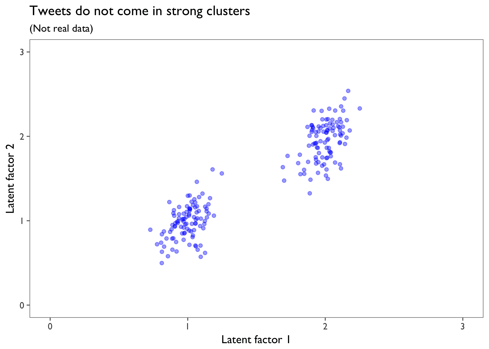
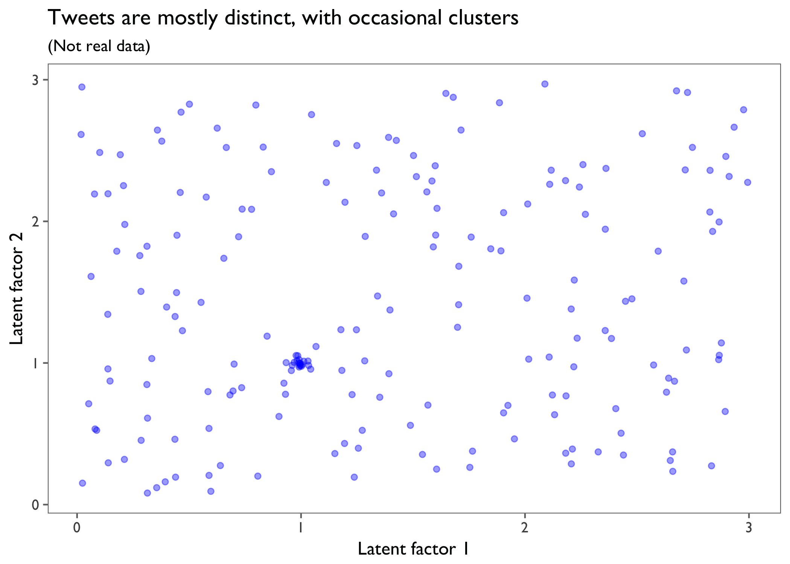
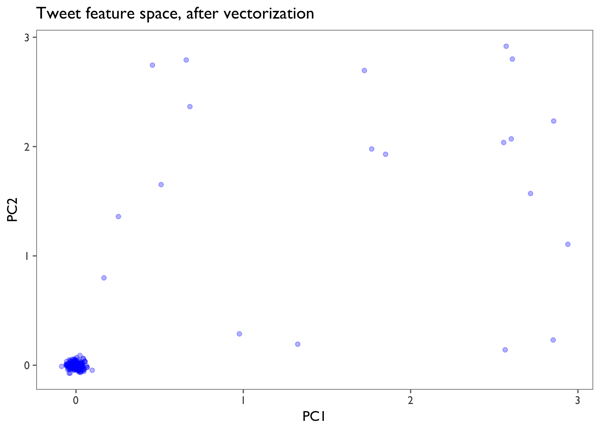
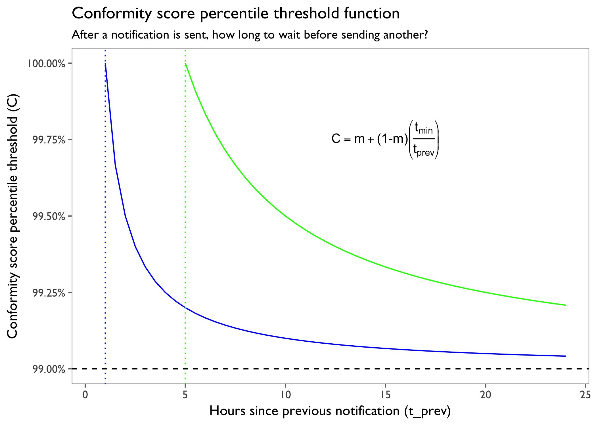

NLP News Tweets: Methodology
================

The goal of this project was to scan all tweets authored by some 25 news publications, and send a notification (i.e. a single tweet) when a big story breaks. This came with a number of challenges.

1. What data to use?
--------------------

Twitter's API provides many attributes for each [tweet](https://dev.twitter.com/overview/api/tweets) and each [user](https://dev.twitter.com/overview/api/users). I decided to keep things simple: I took each tweet's id, its creation time, its text, its favorite count, its retweet count, and its retweet status (i.e. whether or not it was itself a retweet). I also took each tweet's author's username and screen name.

Most of these tweets link to full news stories on their respective publication's webpages. I considered scraping the text of the full stories using Python [Goose](https://github.com/grangier/python-goose), but decided to see how far I could get with the text of the tweets alone, since I anticipated there being some difficulties getting around paywalls. Not to mention that data from HTML can be quite messy.

As for how *much* data to store, I decided to keep only the tweets from the past 24 hours. This usually amounts to about 3500 tweets.

2. How to identify important news stories?
------------------------------------------

This was the main challenge. At first I tried a few off-the-shelf clustering algorithms from sklearn, which required me to first vectorize the tweet texts. I created a document-term matrix, like the example below:

<table style="width:68%;">
<colgroup>
<col width="20%" />
<col width="18%" />
<col width="12%" />
<col width="16%" />
</colgroup>
<thead>
<tr class="header">
<th></th>
<th align="right">test</th>
<th align="right">Japan</th>
<th align="right">ballistic</th>
</tr>
</thead>
<tbody>
<tr class="odd">
<td>North Korea fires missile into waters off Japan <a href="https://t.co/iBM24KTIyU" class="uri">https://t.co/iBM24KTIyU</a></td>
<td align="right">0</td>
<td align="right">1</td>
<td align="right">0</td>
</tr>
<tr class="even">
<td>Japan to take 'concrete action' with US against North Korea after its latest ballistic missile test… <a href="https://t.co/ycZmzebnVa" class="uri">https://t.co/ycZmzebnVa</a></td>
<td align="right">1</td>
<td align="right">1</td>
<td align="right">1</td>
</tr>
<tr class="odd">
<td>MORE: If confirmed as a ballistic missile test, it would be the ninth such test conducted by North Korea this year. <a href="https://t.co/jP7hmAXhww" class="uri">https://t.co/jP7hmAXhww</a></td>
<td align="right">2</td>
<td align="right">0</td>
<td align="right">1</td>
</tr>
</tbody>
</table>

The real document-term matrix had one row for every tweet in the dataset, and one column for each of the top 200 most common words in the whole corpus (after removing [stop words](https://en.wikipedia.org/wiki/Stop_words)). With a few variants of the document-term matrix (word counts and [tf-idf](https://en.wikipedia.org/wiki/Tf%E2%80%93idf), with varying thresholds for inclusion in the matrix), I tried two clustering algorithms: [k-means](https://en.wikipedia.org/wiki/K-means_clustering) and [agglomerative hierarchical clustering](https://en.wikipedia.org/wiki/Hierarchical_clustering).

There were two problems with these approaches. The first problem is that there isn't a good way to choose the number of clusters to look for. If the goal had been simply to model the variance in the tweets as well as possible, then I could have done a grid search over some predefined list of *k*-values, and chosen the model with the best [silhouette](https://en.wikipedia.org/wiki/Silhouette_(clustering)) score. But the goal isn't the model the variance; the goal is to quickly identify a breaking news story, when it occurs, and then select the tweet that is most representative of that story. Besides, we know that the nature of the data is not that each tweet belongs to a clear cluster. The data does *not* look like this:



Rather, a select few tweets will all be lexically close to each other, and everything else will be scattered all across the feature space, more like this:



How many clusters are there, overall? Aside from the fact that there is a clear cluster centered at (1,1), I don't think there's any way to say.

The second problem with the vectorize/cluster approach is that a lot of information is lost during the vectorization. The tweets are mostly about different subjects, so most of the tweets don't even use whichever words happen to be the most common in the full corpus. The document-term matrix ends up being extremely sparse; almost every entry is zero, and most of the rows (the tweets) don't even have any entries. The vectorized data looks more like this:



Now it's the *least* important tweets — the ones that *don't* use the most common words in the corpus — that form the most distinct cluster. As a result, the tweets that we actually care about have been scattered across the feature space. Their use of the most common words in the corpus has caused their differences to be exaggerated and their similarities to be diminished. This is the exact opposite of what I wanted.

Now, I could have vectorized the tweets such that the document-term matrix contained a column for every distinct word that appeared in the dataset. This would have solved the problem we see in the graph above. But that would have created a vastly high-dimensional feature space, which would have made the distances between tweets almost meaningless. So I tried a different strategy. First I transformed the original data to get one row for each word in the corpus:

``` r
# Get one word per row.
tweet_words <- tweets %>%
        unnest_tokens(word, text)

# Clean out highly common and uninformative words.
cleaned_tweet_words <- tweet_words %>%
        
        # Remove stop words.
        anti_join(stop_words) %>%
        
        # Remove html and retweet tokens.
        filter(word != "https",
               word != "t.co",
               word != "rt")
```

The above code turns this...

| screen\_name | text                                                                                                                                          |
|:-------------|:----------------------------------------------------------------------------------------------------------------------------------------------|
| latimes      | Pentagon successfully tests missile defense system amid rising concerns about North Korea <https://t.co/f6h7XMgqop> <https://t.co/4PQR9ZqRWv> |

...into this:

| screen\_name | word         |
|:-------------|:-------------|
| latimes      | 4pqr9zqrwv   |
| latimes      | f6h7xmgqop   |
| latimes      | korea        |
| latimes      | north        |
| latimes      | concerns     |
| latimes      | rising       |
| latimes      | amid         |
| latimes      | system       |
| latimes      | defense      |
| latimes      | missile      |
| latimes      | tests        |
| latimes      | successfully |
| latimes      | pentagon     |

Then I simply counted the number of distinct authors who had used each word in the corpus, and added those counts up word-wise for each tweet:

``` r
breaking_tweets <- cleaned_tweet_words %>%
        
        # Count the number of distinct authors using each word.
        group_by(word) %>%
        summarise(distinct_authors = n_distinct(screen_name)) %>%

        # Join with the dataframe containing one row per word.
        right_join(cleaned_tweet_words) %>% 
        
        # Count the number of authors tweeting words that are present in each tweet.
        group_by(tweet_url) %>%
        summarise(conform_score = sum(distinct_authors)) %>% 
        
        # Join with the original tweets.
        right_join(tweets)
```

I call this the conformity score. It's a measure of how much a tweet conforms to tweets by other authors; it's a proxy for whether the tweet is talking about What Everyone Is Talking About. (The reason I counted distinct authors rather than distinct tweets is that some authors have specific formats for their tweets where similar words occur very frequently. We shouldn't care when a tweet conforms to the language in other tweets by its own author.)

Let's take a look at the tweets in my current dataset that have the highest conformity score:

| screen\_name | created\_at                    |  conform\_score| text                                                                                                                                           |
|:-------------|:-------------------------------|---------------:|:-----------------------------------------------------------------------------------------------------------------------------------------------|
| TIME         | Tue May 30 13:10:07 +0000 2017 |             173| Trump condemns Portland attack, Manuel Noriega dies and Tiger Woods blames meds for DUI charge. What to know today: <https://t.co/LwyomWVe7x>  |
| AP           | Tue May 30 16:20:12 +0000 2017 |             160| BREAKING: City of Cleveland fires police officer who shot 12-year-old Tamir Rice in 2014, suspends his partner for 10 days.                    |
| ABC          | Tue May 30 02:09:14 +0000 2017 |             157| Iraqi officials say 10 killed, 22 injured after car bomb explodes outside popular ice cream shop in central Baghdad… <https://t.co/RhODTjKIDT> |
| BBCNews      | Tue May 30 14:57:29 +0000 2017 |             152| RT @BBCBreaking: Golfer Tiger Woods was found asleep at the wheel of his car, engine running, police report says - US media <https://t.co/q0>… |
| CNN          | Tue May 30 11:20:34 +0000 2017 |             152| ISIS claims responsibility for a car bomb explosion outside an ice cream shop in Baghdad that killed at least 10… <https://t.co/tRzgpclJRN>    |
| CNN          | Tue May 30 04:30:01 +0000 2017 |             152| ISIS claims responsibility for a car bomb explosion outside an ice cream shop in Baghdad that killed at least 10… <https://t.co/g8jpWrQ8Qk>    |

These tend to be fairly big stories. That's because the words used in these tweets are used by many distinct authors in the dataset. You might think my bot would simply retweet the tweet with the highest conformity score, but it's not that simple.

3. How to decide when to send a notification?
---------------------------------------------

The goal for this project was to send the best tweet from a breaking news story to a separate module, which would send a push notification. The script needs to make a decision every ten minutes about whether or not to send a notification. And when a big story breaks, we want to send the notification as soon as possible. But we don't want to bother the users — we should send a maximum of two notifications per day. So whatever function we use to decide whether to send a notification, the function needs to include three pieces of information:

1.  How big is the story? We'll only send notifications for big stories that everyone is talking about.
2.  How long has it been since the last notification was sent? In the flurry of tweets that are authored in the hours after a big story breaks, we don't want to keep sending notifications about that story just because it's big.
3.  What stories have we already sent notifications for? Sometimes a good tweet for a big story will be authored many hours after the story first broke; we don't want to send that tweet as a notification.

In my script, a tweet has to meet several conditions for it to qualify as worthy of notification. The first is that it must be one of the most highly conforming tweets of the past 24 hours. Namely, it must have a conformity score that is at least in the 99th percentile. This will be the asymptote of the conformity threshold — call it *a*.

`asymptote <-  0.99`

*a* = 0.99

The 99th percentile is the absolute minimum threshold that a tweet must meet, but this requirement is stricter the more recently a notification has been sent. (If we send a notification a 2pm, then we'd better have a very good reason to send another one at 3pm.) To set the minimum amount of time that must pass after a notification has been sent, before another one will be sent, we just need to add 1 − *a* to that asymptote to push it above the 100th percentile, where no tweet can reach. But the value we add to the asymptote can decrease as more time passes, so that we're less stringent if we haven't sent a notification in the past 12 hours, say. To achieve this, we can use a reciprocal function:

$C = a + (1-a)\\left(\\frac{t\_{min}}{t\_{prev}}\\right)$,

where *C* is the conformity score percentile threshold function, *t*<sub>*m**i**n*</sub> is the minimum amount of time (in hours) that must pass before a new notification is sent, and *t*<sub>*p**r**e**v*</sub> is the amount of time that has passed since the previous notification was sent. Below, you can see two versions of the threshold function. The blue curve has *t*<sub>*m**i**n*</sub> = 1, and the red curve has *t*<sub>*m**i**n*</sub> = 5. You can see that if the *t*<sub>*m**i**n*</sub> were set to 5, we would be forcing the system to wait a full five hours before any tweet could have a chance of being sent as a notification. After that, the minimum percentile decreases steadily as time passes.



There are a few more checks that the tweets have to satisfy in order to be considered for notification. First, the tweet must have been created in the past hour. I don't particularly care if a tweet from 13 hours ago is in the 99.9th percentile for its conformity score — that story is old news. I only care if there's a *new* story that everyone is talking about. Second, the tweet must not share any (non-stop-)words with the tweet that was sent as the previous notification. This helps guard against notifying the user of the same story several hours later, when people are still talking about that story on Twitter. Finally, the tweet must not be alone; that is, I require a minimum of four tweets to cross the prior thresholds, just as a final check to ensure that there is a *new* story that everyone is talking about. Once there are a minimum of four tweets that pass these tests, they're sent on to one last function to determine which one is the best for the notification.

4. How to select the best tweet for the notification?
-----------------------------------------------------

This part is pretty simple. My script allows a user to set weights on three tweet variables: its conformity score, its favorite count, and its retweet count. The default is that the conformity score is worth 60% of the notification score, the favorite count is worth 20%, and the retweet count is worth 20%. Whichever tweet has the height weighted sum of these three attributes gets to be sent as a notification. I could have used the conformity score alone, but I figured the favorite count and the retweet count would allow for a bit of quality control; the best tweets are typically well-written, with links to valuable content, and the favorite/retweet counts are probably correlated with those desirable qualities.

There you have it! If you'd like to see what my bot has been up to recently, you can see its activity (and even follow it — though you'll make it blush) right here:

<https://twitter.com/news_nlp_bot>
